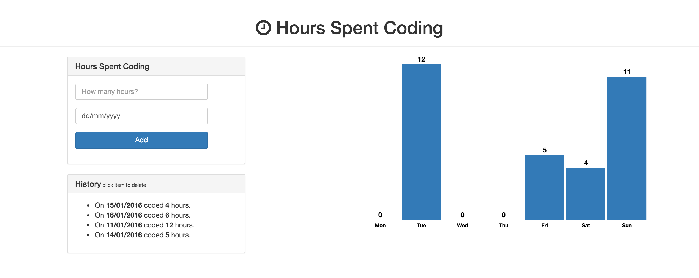
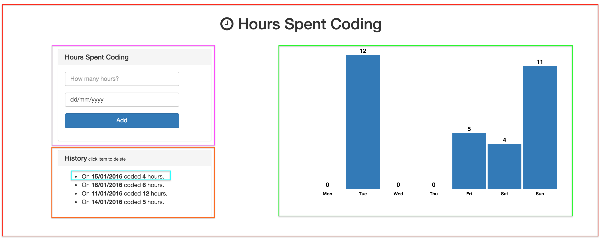

#Advanced JavaScript
This tutorial is going to teach you more advanced JavaScript using the new kid on the block: React! 

Apart from using React to render views, we will also use D3 to render a chart, Twitter Bootstrap to make our app look awesome and Meteor to do all the heavy lifting in setting up a new web application and a MongoDB database.

At the end of this tutorial, you will have a very simple web app that can do a lot of stuff! We will track how many hours we spent coding on certain week days by having a form where we can enter the hours for a given date. Then we'll store that in the database and retrieve the data for our D3 chart. All of this is going to use React to render our views.

 

Here is also a [live preview](https://still-temple-12247.herokuapp.com/) of the app!

Sure it looks very simple but it uses a lot of advanced concepts under the hood to get there! More on JavaScript concepts can be found in this series of [online books](https://github.com/getify/You-Dont-Know-JS).

#What is Meteor?
[Meteor](https://www.meteor.com/) is a cohesive development platform, a collection of libraries and packages that are bound together in a tidy way to make web development easier. It builds on ideas from previous frameworks and libraries to offer an easy way to start a prototype app, but it gives you the tools and flexibility to build a full fledged production app. Their documentation can be found [here](http://docs.meteor.com/#/basic/).

#What is React?
[React](http://facebook.github.io/react/) is a JavaScript library for creating user interfaces by Facebook and Instagram. Many people choose to think of React as the V in MVC. Since React makes no assumptions about the rest of your technology stack, it's easy to try it out on a small feature in an existing project.

React abstracts away the DOM from you, giving a simpler programming model and better performance. React can also render on the server using Node, and it can power native apps using [React Native](https://facebook.github.io/react-native/).

React components implement a mandatory render() method that takes input data and returns what to display. It prefers to use an XML-like syntax called JSX. Input data that is passed into the component can be accessed by render() via this.props. *JSX is optional* and not required to use React.

You can learn more about it here by creating a [ToDo application](http://todomvc.com/examples/react/#/) but see if you can follow aling with this tutorial first.!

> [info]
> **React vs. other frameworks**
> 
> So here is the thing, React is NOT a framework! That's kind of the crux of the matter. It's odd to compare React to Angular or Backbone, as the latter two are frameworks built on the MVC architecture ready to build fully-fledged web applications, while React can be seen as the V in **MVC**. It can be used in the Angular or Backbone framework as the replacement of their views rather than its replacement.
> 
> However! React was designed with the [Flux architecture](https://facebook.github.io/flux/docs/overview.html) in mind, a completely different (reactive) architecture to [MVC](https://en.wikipedia.org/wiki/Model%E2%80%93view%E2%80%93controller). Check out the documentation on the Flux architecture if you want to learn more about it.

A more advanced resource on React is [this starter kit](https://github.com/kriasoft/react-starter-kit) to get you started on fully-fledged web applications using the Flux architecture and a node server. 

#What is D3?
[D3.js](http://d3js.org/) is a JavaScript library for manipulating documents based on data. D3 helps you bring data to life using HTML, SVG, and CSS. D3’s emphasis on web standards gives you the full capabilities of modern browsers without tying yourself to a proprietary framework, combining powerful visualization components and a data-driven approach to DOM manipulation. Check out their amazing [demo projects](https://github.com/mbostock/d3/wiki/Gallery)!

#What is Heroku?
[Heroku](https://www.heroku.com/) is a very nice PaaS provider which makes it dead easy to host your Application (it doesn’t matter if it’s a Node, Ruby, Python or other application) in the cloud.
You can scale your application in a matter of seconds and add addons (such as MongoDB Provider, Mailgun, …) to your application. You can easily deploy your newest version of your application with a simple git push command which is pretty neat!

#Designing the web application
As React is a component-based framework, it makes sense to spend a little time on the design of the application to save time later. We want our layout to have two columns later. The left column will have a form to insert data and a list of all data previously inserted where one will be able to remove it by clicking. The right column will render a bar chart. Let’s breakdown our app into React components:

The App component (red box) encompasses all components and will be responsible for gathering data from the MongoDB and passing it accordingly.

The pink rectangle is the HourForm component. It’s a basic form where we will add the number of hours and the day that event happened.

The orange rectangle is the HourList component, which encapsulates the data and renders a HourItem component (in light blue), formatting the data nicely and allowing us to click on any record to delete it.

Finally, the green rectangle is our star – the HourChart component. It will receive data from Meteor and render this awesome D3 chart. This component will be designed to be reusable, so the only thing we will need to do is pass the correspondent data into it and it will be able to render the chart (with a horizontal label and a top label informing quantity).

So now that we know the design of our components, let's get started on building our web app!
