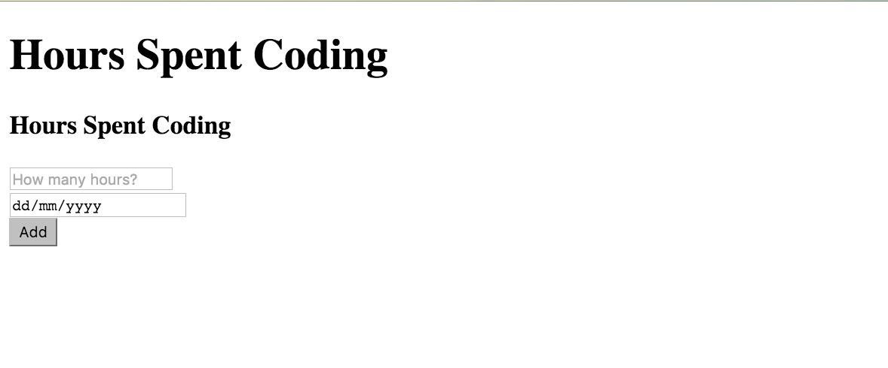

---
title: "Going React"
slug: going-react
---     

#The Frontend
Now that we have our backend up and running, let's work on the views that will display our content. The first view we create is the HTML that will bring our components on the page.

> [action]
> Create a folder called **client** and add an index.html file into the client directory. Try adding the usual boilerplate HTML and check your server in the terminal (where you executed the `meteor` command). 

<!-- break -->

> [solution]
> You should be seeing that it is not possible to add the `<html>` tags because Meteor does it for you. Instead just add the head and body tags. This takes a bit of getting used to!
 
Now that we have our index file up and running, we should add a div that we will use to render the React component in it. You could use the body tag but it is bad practice and React will throw a warning in the browser console:

*Rendering components directly into document.body is discouraged, since its children are often manipulated by third-party scripts and browser extensions. This may lead to subtle reconciliation issues. Try rendering into a container element created for your app.*

> [action]
> Add a div tag with id into the body tag.

Now that we are set up on the HTML side, let's add our first JSX file, the init file. It will have the file ending with **.jsx**.

> [info]
> **What is JSX?**
> 
> JSX is a preprocessor step that adds XML syntax to JavaScript. You can definitely use React without JSX but JSX makes React a lot more elegant. Just like XML, JSX tags have a tag name, attributes, and children.

Inside of the file, we want to start our Meteor app and render our first React component.

> [action]
> Add a new file called init.jsx inside the client folder.
> 
> Add the following code to get started:
>
> ```
>    Meteor.startup(function() {
>      ReactDOM.render(<App />,  document.getElementById('container'));  
>    });
> ```

Now the problem is that we are calling the **App** component here and want to render it to the div that we have selected but we haven't created this component yet. So let's do it!

> [action]
> Create a file called app.jsx inside the client folder.

Inside of the component, we will add some React methods. React.createClass() is where you create your components. The only mandatory function every component must have is the render function, the place you will actually render something into the DOM. 

> [action]
> Looking at the [React documentation](https://facebook.github.io/react/docs/top-level-api.html#react.createclass), you will see that you need to declare the object App and then use the **createClass** function. Within it, we will use the render function to write our JSX - which is essentially just HTML that can support other React components. More to this later.
> 
> Also add a function inside the return statement of the getMeteorData function, which will get all content back form the database and store it in a key called hours (key - value).
> 
> Don't forget to add a header to your page, write something like "Hours Spent Coding". 
>
> ```
>    // Give your component a name called App - use React.createClass to create the object
>    App = React.createClass({
>      // Add the ReactMeteorData mixin - we need to connect our data to our view
>      mixins: [ReactMeteorData],
> 
>      // Get data from the database and store it in the hours variable 
>      getMeteorData: function() {
>        // Get all data from the Hours collection
>        return {
>          // Use the Mongo Collection find method to get all data
> 			 CODE HERE	
>        }
>      }, 
> 
>      // Use React's render function and write some JSX (which uses regular HTML) 
>      // to support our 2 column structure and a div for each component we will have
>      render: function() {
>        // Return the JSX inside of brackets  
>        return (
>          // CODE HERE - Put your HTML here
>        );
>      }
>    });
> ```

Now that we have our App component set up, check that it renders without problems in the browser. You should see a title only at this point, so let's add our first form.

#The Form
The form will be a new React component, so let's add it by creating a new file called hourForm.jsx and add some content to it. 

> [action]
> Add the file and create a new React component called **HourForm** and add a render function to it. Inside the render function, return the JSX again. Remember JSX is just HTML! One point to note: Use ref attributes for the input fields as you will get the DOM nodes of the fields through the ref attribute.

<!-- break -->

> [solution]
> You should have something along these lines:
> 
> ```
>    //Give your component a name called HourForm - use React.createClass to create the object
>    HourForm = React.createClass({
>      
>        render: function() {    
>        // Return your JSX within brackets - the HTML should display a simple form with 
>        // 2 input elements and a submit button
>        return (
>    	      CODE HERE 	 	
>        );
>      }
>    });
> ```

Now that you have your form up and running, let's connect the submit button to a function that will take the values from the inputs and saves them in the database.

> [action]
> Add a new function to your HourForm object and call it **handleSubmit**. Inside that function we need to prevent the [defaultEvent](https://developer.mozilla.org/en-US/docs/Web/API/Event/preventDefault) that occurs when a button is clicked. 
> 
> Use [React.findDOMNode](https://facebook.github.io/react/docs/top-level-api.html#reactdom.finddomnode) to get access to the input values and store them in a variable.
> 
> Once you have access to the values, use [Meteors call method](http://docs.meteor.com/#/basic/Meteor-call) to store the inputs values in the database.
> 
> Reset the input fields to empty strings at the end by using **.value** on the stored input variables and just setting them to empty strings. 

<!-- break -->

> [solution]
> 
> ```
>    HourForm = React.createClass({
>      
>      handleSubmit: function(e) {
>        // Use the preventDefault function on the passed in event
>        CODE HERE
>        // Access the input fields using React.findDOMNode and store them in a variable
>        CODE HERE
>        // Use Meteor's call function 
>        // Pass the insertHour function as first parameter
>        // Pass the hours value as the second parameter
>        // Pass the date value as the third parameter - Use Moments toDate function to pass it as an ISO date
>        // Pass an anonymous callback as the fourth parameter that alerts if something goes wrong
>        CODE HERE
>        
>        // Reset the input values to empty strings
>        CODE HERE
>      },
>     
>      render: function() {    
>        return (
>          ...
>        );
>      }
>    });
> ```

You need to connect the form to the function on submit and we do this by using the following event handler on the form tag:

`<form onSubmit={this.handleSubmit}>`

This will trigger the submit function when the button is clicked.

> [action]
> Add the trigger to your form. Don't forget to add your new HourForm component into the App component!

You should have something like this now:



Now that isn't exactly beautiful so let's fix this up using the Twitter Bootstrap library!
