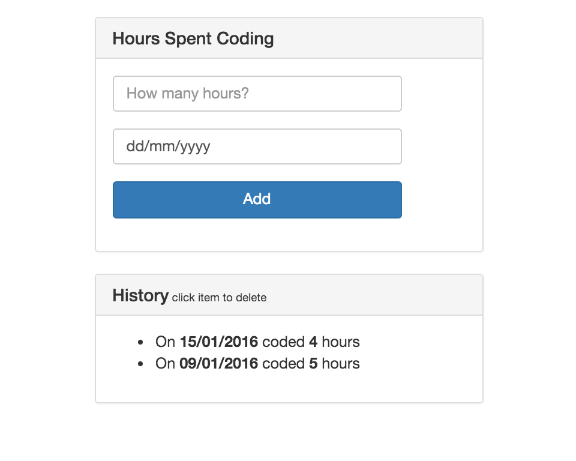

---
title: "More React Components"
slug: more-react-components
---     

Now that we have our form, we should add a little history widget that keeps track of when we added hours to our database. Let's go back to our app.jsx file and add a function to it that gets the data from the database, so we can use it in the views.

#this.props
Back in app.jsx, we pulled in the ReactMeteorMixin, which tells React to go and fetch data from our Meteor database. The function **getMeteorData()** says you are storing the object hours in this.data. Better still, it’s reactive! You now can pass it via props to children components. 

> [info]
> **What are props?**
> 
> A most excellent question. Essentially they are an elements data. You can pass props from a parent component to a child component and that is all the data that will be accessible in the child component. There is a good answer to this on [Stackoverflow here](http://stackoverflow.com/questions/27991366/what-is-the-difference-between-state-and-props-in-react).

#Add the HourList component
We've already made a component, so go ahead and add another for our list.

> [action]
> Add the hourList.jsx file to the client folder.
> 
> Create a React component called HourList and add a render method, which should render a table that looks like this (below the form):
> 
> 
> 
> You will need to create another React component for the list items inside the list container.
> 
> Don't forget to add your new HourList component to the App component. You have to pass the data from the database to the HourList component using **props**. It should look like this:
> 
> ```
>    <div className="col-md-4">
>      <HourForm />
>      <HourList data={this.data.hours}/>    
>    </div>
> ```
> 
> The ListItem component should be added based on the data that gets passed using props. Iterate over this.props.data with a map function and render your ListItem component in the loop. Don't forget to pass the hour as props to the item.

<!-- break -->

> [solution]
> This is the outline for HourList component:
> 
> ```
>    //Give your component a name called HourList - use React.createClass to create the object
>    CODE HERE
>      
>      // render the item component in a separate function
>      renderHours: function() {   
>        // Iterate over this.props.data using the map function. Return the loop
>        CODE HERE
>          // Return the HourItem component, pass hour and key to it. 
>          CODE HERE (inside the map function)
>    
>      },
>    
>      // render the HourList JSX
>      render: function() {    
>        // return the JSX using ()
>        return (
>          CODE HERE - HTML!
>        );
>      }
>    
> ```
> 
> This is the outline for the HourItem component:
> 
> ```
>    // Give your component a name called HourItem - use React.createClass to create the object
>    HourItem = React.createClass({
>      
>      // Write an event handler for the onClick event, called handleClick.
>      handleClick: function() {
>        // Store id in a variable. Access it from this.props.
>        var id = CODE HERE;
>        
>        // Use the Meteor method "call". Pass 'removeHour' as the first parameter, id as the second, 
>        // a function alerting any errors as third parameter
>        CODE HERE
>      },
>     
>      // Obligatory render method
>      render: function() {
>        // Get the date from this.props.hour.date and format it to 'DD/MM/YYYY' using Moment. Store it in a variable.
>        var date = CODE HERE,
>        // Determine if the end of the sentence should say hour or hours based on this.props.hour.hours. Store it in a variable.
>            sentEnd = CODE HERE;
>        
>        // Return a list item with an onClick handler. Let the item say "On DD/MM/YYYY coded ? hour/hours."
>        // Variables have to be accessed within curly brackets => {date}
>        return (
>          CODE HERE - HTML/JSX
>        );
>      }
>    });
> ```

Our first column is done and you should be able to insert items through the form and delete any item by just clicking on each list item in the history component.
