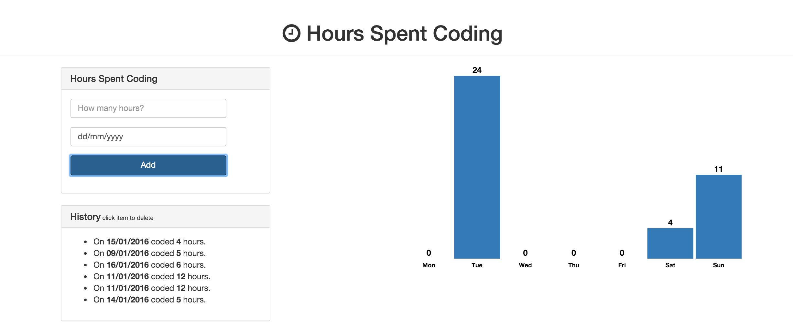

---
title: "Using D3 to create charts"
slug: d3-chart
---     

#D3 Charts
D3 is a JavaScript charting library that we can use for fantastic chart-based visualisations. You should definitely go and check out their library [here](http://d3js.org/). It is truly amazing!

However their library has quite a learning curve, so we'll start easy by "just" adding a bar chart to our web application that will breakdown the hours we work on by week day. 

React has a well-defined [components lifecycle](https://facebook.github.io/react/docs/component-specs.html#lifecycle-methods). Have a read of the individual methods, so you get a better understanding of what we are doing. 

#React Component Lifecycle
The methods that are of most interest for us here are the following:

* [componentDidMount](https://facebook.github.io/react/docs/component-specs.html#mounting-componentdidmount) is invoked once when the component is first rendered. In it, we will create an svg tag inside the div that the  component will render (returned by the ReactDOM.findDOMNode(this) function). After that, we will call the rendering function to draw the bars in case there is any data.
* [componentWillUpdate](https://facebook.github.io/react/docs/component-specs.html#updating-componentwillupdate) is invoked every time any props change. This means that as our data is reactive, any change will trigger the custom updateChart(props) function (which we will define soon). Note the function takes a parameter of *props*, which is exactly what we need – whenever the props change, we need to pass the new props to the rendering function.
* [getDefaultProps](https://facebook.github.io/react/docs/component-specs.html#getdefaultprops) is a good place to set default values. In this case, we are setting the default values for width and height. It would also be possible to pass them dynamically in from the parent component.
* [render](https://facebook.github.io/react/docs/component-specs.html#render) - our mandatory render function will return an empty div that we will use to render our svg into it.

It’s worthy to note that our App component might take a while to fetch all the data, so the component might be initialized without any data. To project us from this, we want to update the view accordingly once we have data (newProps) using the *componentWillUpdate* callback.

> [action]
> Create the HourChart React component. Complete the four above methods. You will have to use the [D3 select method](https://github.com/mbostock/d3/wiki/Selections#d3_select) to create a canvas.
> 
> ```
>    //Give your component a name called HourChart - use React.createClass to create the object
>    HourChart = React.createClass({
>    
>      // Create the SVG when component is mounted and call renderChart
>      componentDidMount: function() {   
>        // Get the div from this component using findDOMNode
>        var el = CODE HERE,
>        // Create a canvas (svg) using D3s select method and 
>        // this.props.weight & this.props.height as attributes
>            svg = CODE HERE;
>        
>        // Call this.renderChart and pass props (renderChart is not implemented yet!)   
>        renderChart(this.props);
>      },
>    
>      // Call the renderChart function with the newly passed props
>      componentWillUpdate: function(newProps) {      
>        CODE HERE
>      },
>    
>      // Set default props here 
>      getDefaultProps: function() {
>        // Set a default for width & height
>        return {
>          CODE HERE
>        }
>      },
>    
>      // Create the D3 chart
>      renderChart: function(props) {
>        // We will do this in the next section!
>      },
>    
>      // Render a simple div with class "chart"
>      render: function() {
>        return (
>           CODE HERE - HTML/JSX       
>        );
>      }
>    
>    });
> ```

Now that we have our basic methods of the life cycle up and running, we need to create the chart of course! We will do this in the updateChart method. D3 can look a bit intimidating but let's go through it step by step.

#renderChart 
Working with D3 can look scary at first as you have to come up with a lot of variables and their documentation can be a bit difficult to navigate at first. But persevere and you'll see it looks harder than it is!

> [action]
> Complete the renderChart function based on the comments below. Note that we have broken the individual parts into their separate functions for readability and clarity. You should add those functions as well. 
> 
> The yScale and xScale are already defined but go to the documentation and read up what that actually does to understand it. 
> 
> Note that you can use [Underscore's max function](http://underscorejs.org/#max) to calculate the highest value of q for the max variable. 
> 
> ```
>    // Render the D3 chart using the passed in props
>    renderChart: function(props) {
>      // Store this.props.data in a variable
>      var data = CODE HERE,
>      // Use _ (Underscore) max function to return the maximum value from q
>          max = CODE HERE,
>      // Use D3s select to get the svg
>          svg = CODE HERE,
>      // Select all 'rect' from svg - use selectAll - call data on bars and pass your data 
>          bars = CODE HERE,
>      // Construct a new linear scale https://github.com/mbostock/d3/wiki/Quantitative-Scales#linear for the y axis
>          yScale = d3.scale.linear()
>                     .domain([0, max])
>                     .range([0, props.height - 35]),
>      // Construct a new ordinal scale https://github.com/mbostock/d3/wiki/Ordinal-Scales#ordinal for the x axis
>          xScale = d3.scale.ordinal()
>                     .domain(d3.range(data.length))
>                     .rangeRoundBands([0, props.width], 0.05);
>  
>      // Set up the code for the bars
>      this.setupBars(bars, xScale, yScale);
>  
>      // Set up the labels for the x axis
>      this.setupQLabels(svg, xScale, yScale);
>  
>      // Set up the labels for each bar 
>      this.setupLabels(svg, xScale);
>    },
> ```

The setupBars function starts by [entering](https://github.com/mbostock/d3/wiki/Selections#enter) the elements and doing a [transition](https://github.com/mbostock/d3/wiki/Selections#transition) before [exiting](https://github.com/mbostock/d3/wiki/Selections#exit) the elements again. Read up on what this means in the D3 documentation. 

* **Entering** - Bind all rect elements to the data we mapped previously and handle when a new rect is detected (append to the svg and set its color).
* **Transitioning** - Perform updates. Transitions smooth the changes and set the new values of x, y, width and height. We also add some space to the bottom to insert another label.
* **Exiting** - Delete unnecessary rects.

We repeat this three times for each of the elements we want to render (the bars, qLabels and labels). D3 is a trial-and-error library until you start to feel comfortable. So go ahead, play around with the values!

> [action]
> Complete the setupBars function:
> 
> ```
>    setupBars: function(bars, xScale, yScale) {
>      var self = this;
>    
>      // Use D3s enter to start the bars https://github.com/mbostock/d3/wiki/Selections#enter
>      bars.enter()
>          .append('rect')
>          .attr('fill', '#337ab7')         
>    
>      // Use D3s transition to start a transition for the bars https://github.com/mbostock/d3/wiki/Selections#transition
>      bars.transition()
>          .duration(1000) // Use a duration of 1 second
>          .attr('x', function(d, i) {         
>            // Return xScale for this - pass i
>            CODE HERE
>          })
>          .attr('y', function(d, i) {
>            // Return self.props.height minus the yScale
>            CODE HERE
>          })
>          .attr('width', xScale.rangeBand())
>          .attr('height', function(d, i) {
>            // Return the yScale for this - pass d.q
>            CODE HERE
>          });
>    
>      // Use D3s exit and remove to finish the bars 
>      // exit - https://github.com/mbostock/d3/wiki/Selections#exit 
>      // remove - https://github.com/mbostock/d3/wiki/Selections#remove
>      bars.exit()
>          .remove();
>    },
> ```

D3 is very tough to wrap your head around, so here is the solution to help you work out the logic.

> [solution]
> The complete setupBars function: 
> 
> ```
>    setupBars: function(bars, xScale, yScale) {
>      var self = this;
>    
>      // Use D3s enter to start the bars https://github.com/mbostock/d3/wiki/Selections#enter
>      bars.enter()
>          .append('rect')
>          .attr('fill', '#337ab7')         
>    
>      // Use D3s transition to start a transition for the bars https://github.com/mbostock/d3/wiki/Selections#transition
>      bars.transition()
>          .duration(1000) // Use a duration of 1 second
>          .attr('x', function(d, i) {         
>            // Return xScale for this - pass i
>            return xScale(i);
>          })
>          .attr('y', function(d, i) {
>            // Return this.props.height minus the yScale for this
>            return self.props.height - yScale(d.q) - 20;
>          })
>          .attr('width', xScale.rangeBand())
>          .attr('height', function(d, i) {
>            // Return the yScale for this - pass d.q
>            return yScale(d.q)
>          });
>    
>      // Use D3s exit and remove to finish the bars 
>      // exit - https://github.com/mbostock/d3/wiki/Selections#exit 
>      // remove - https://github.com/mbostock/d3/wiki/Selections#remove
>      bars.exit()
>          .remove();
>    },
> ```

Now we need to write two more functions like this for the qLabels and the labels.

> [action]
> Complete the setupQLabels and setupLabels function.
> 
> ```
>    setupQLabels: function(svg, xScale, yScale) {
>      var self = this,
>      // Select all qLabels from the svg and call data on it, passing this.props.data
>          qLabel;
>    
>      // Enter the qLabel and append some text. Use attr to give it a qLabel class. Style it appropriately.
>      qLabel.enter()
>          .append(TODO)
>          .attr(TODO)
>          .style(TODO)
>          .attr(TODO)
>    
>      // Start a transition 
>      qLabel.transition()
>            .duration(1000)                 
>            .attr('x', function(d, i) {
>              // Return the xScale (pass the passed in index) plus the rangeBand of the xScale divided by 2
>              CODE HERE
>            })
>            .attr('y', function(d, i) {
>              // Return props.height minus the yScale (pass d.q to it), subtract 25
>              CODE HERE
>            })
>            .text(function(d, i) {  
>              // Return d.q          
>              CODE HERE
>            });
>    },
> ```
 <!-- break -->
 
> [solution]
> We know D3 is tricky, so here is the solution again for the setupQLabels function again:
> 
> ```
>    setupQLabels: function(svg, xScale, yScale) {
>      var self = this,
>      // Select all qLabels from the svg and call data on it, passing this.props.data
>          qLabel = svg.selectAll('.qLabel').data(this.props.data);
>    
>      // Enter the qLabel and append some text. Use attr to give it a qLabel class. Style it appropriately.
>      qLabel.enter()
>          .append('text')
>          .attr('class', 'qLabel')
>          .style('font-weight', 'bold')
>          .attr('text-anchor', 'middle')
>    
>      // Start a transition 
>      qLabel.transition()
>            .duration(1000)                 
>            .attr('x', function(d, i) {
>              // Return the xScale (pass the passed in index) plus the rangeBand of the xScale divided by 2
>              return xScale(i) + xScale.rangeBand()/2;
>            })
>            .attr('y', function(d, i) {
>              // Return props.height minus the yScale (pass d.q to it), subtract 25
>              return self.props.height - yScale(d.q) - 25
>            })
>            .text(function(d, i) {  
>              // Return d.q          
>              return d.q; 
>            });
>    },
> ```

Ok, we only have one function left, the setupLabels function and we're all set!

> [action]
> This is pretty much the same as the above two functions. Try to complete the function on your own before peeking at the solution.
> 
> ```
>    setupLabels: function(svg, xScale) {
>      var self = this,
>      // Select all label classes from the svg and call data on it passing this.props.data
>          label = CODE HERE;
>    
>      // Enter the label and append some text. Use attr to give it a label class.
>      label.enter()
>           .append(TODO)
>           .attr(TODO)
>    
>      // Use D3s text method to add the text to the label
>      label.text(function(d, i) { 
>           // Return the label of the passed in d           
>             CODE HERE   
>           })
>           .attr(TODO)
>           .attr('x', function(d, i) {
>             // Return xScale (pass the index) plus the rangeBand of xScale divided by 2
>             CODE HERE
>           })
>           .attr('y', function(d, i) {
>             // Return props.height minus 5
>             CODE HERE 
>           });
>    },
> ```


<!-- break -->

> [solution]
> D3 is hard! So here is the last solution we'll give you if you need to check any logic. 
> 
> ```
>    setupLabels: function(svg, xScale) {
>      var self = this,
>      // Select all label classes from the svg and call data on it passing this.props.data
>          label = svg.selectAll('.label').data(this.props.data);
>    
>      // Enter the label and append some text. Use attr to give it a label class.
>      label.enter()
>          .append('text')
>          .attr('class', 'label')
>    
>      // Use D3s text method to add the text to the label
>      label.text(function(d, i) {            
>              return d.label; 
>           })
>           .attr('text-anchor', 'middle')
>           .attr('x', function(d, i) {
>             // Return xScale (pass the index) plus the rangeBand of xScale divided by 2
>             return xScale(i) + xScale.rangeBand()/2;
>           })
>           .attr('y', function(d, i) {
>             // Return props.height minus 5
>             return self.props.height - 5; 
>           });
>    },
> ```

You should now have a lovely graph in D3 up and running: 



That's great work! You now have a basic understanding of React and D3. Now you might think that you are done but alas...  not quite! What we haven't done yet here is refactoring and deploying to Heroku.
