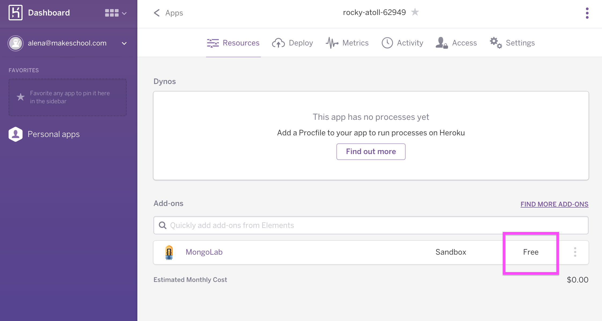

---
title: "Deploying to Heroku"
slug: deploy-to-heroku
---     

More bonus content! If you want your little web app live, then lets publish it to Heroku!

Heroku is a service that will take your Ruby on Rails project and create a website with it.

You should start by creating an account at https://signup.heroku.com/www-header. Make sure you remember your username and password - you will need it later.

Before we can upload our code to Heroku, we have to install some tools first.

You can install Heroku’s special tool here: [https://toolbelt.heroku.com/](). Only download and install the tool, do not follow the other instructions on the page.

This tool creates new commands you can use in the Terminal.

When you have installed the Heroku Toolbelt, you have to log into your account from the Terminal.

`$ heroku login`

Enter your Heroku username and password. You should see this message if everything works:

`$ Authentication Successful` (do not type this)

Now we have send our code to Heroku. Type the following commands in the terminal to do that. Remember to press “enter” after each command. Some commands will take a long time to execute.

Make sure your that your terminal is in the right directory that you created for your web app.
 
Use cd to change directory.

It should look something like this:

```
$ git init (only the first time!!)
$ git add .
$ git commit -m "init"
$ heroku create (only the first time!!)
```

Now that we created a Heroku app, you should be able to see it in your Heroku dashboard online. 

We are almost there, we still need to add a database and buildpack to Heroku, so that Heroku knows how to deploy our web app. To do that we will use the [Heroku Buildpack for Meteor](https://github.com/jordansissel/heroku-buildpack-meteor).

Run this in your terminal:

`heroku buildpacks:set https://github.com/AdmitHub/meteor-buildpack-horse.git`

Now we need to configure our database:

`heroku addons:create mongolab:sandbox` 

This will most likely error with the following message:

```
$ heroku addons:create mongolab:sandbox
!    Please verify your account to install this add-on plan (please enter a credit card) 
For more information, see https://devcenter.heroku.com/categories/billing 
Verify now at https://heroku.com/verify
```

This is because you need to enter your credit card details on the Heroku account. Don't worry, the DB we are using is a sandbox, so it is free! Heroku will ask for your details anyways.

Once you enter them on your Heroku account, run the above command again and this time it should complete and give you this message:

```
$ heroku addons:create mongolab:sandbox
Creating mongolab-tetrahedral-72918... done, (free)
Adding mongolab-tetrahedral-72918 to rocky-atoll-62949... done
Setting MONGOLAB_URI and restarting rocky-atoll-62949... done, v3
Welcome to MongoLab.  Your new subscription is being created and will be available shortly.  
Please consult the MongoLab Add-on Admin UI to check on its progress.
Use `heroku addons:docs mongolab` to view documentation.
```

Let's just check on Heroku that we now have a database:

> [action]
> Go to your Heroku dashboard (https://dashboard.heroku.com/apps/*your_heroku_app_name*/resources). You should now see the database under Add-Ons.
> 
> 
> 
> You can see that it is free to use the MongoDB sandbox on Heroku. Yeah!

Let's set a few more environments config options, we're almost there:

> [action]
> 
> `heroku config:set ROOT_URL=https://<yourapp>.herokuapp.com`
> 
> Hit enter. You should see the following message now:
> 
> ```
> $ heroku config:set ROOT_URL=https://still-temple-12247.herokuapp.com
> Setting config vars and restarting still-temple-12247... done
> ROOT_URL: https://<yourapp>.herokuapp.com
> ```
> 
> Now we need to push our code to Heroku.
> 
> `git push heroku master`

Wait until it pushed and deployed your application (this is going to take a while!), then go to your Heroku app URL (you should have seen it when you created your Heroku app!) and check out your brandnew live web application. If you can't remember your URL, go to your Heroku dashboard, you will find under the *Settings* tab. Well done on deploying your first web application!
